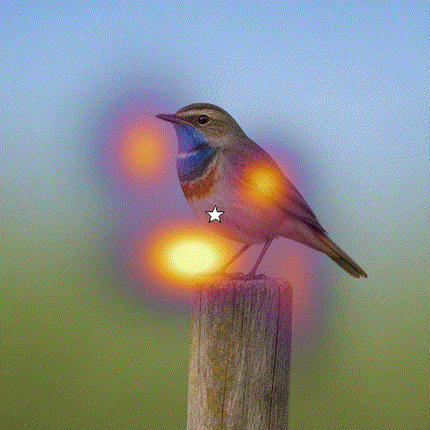
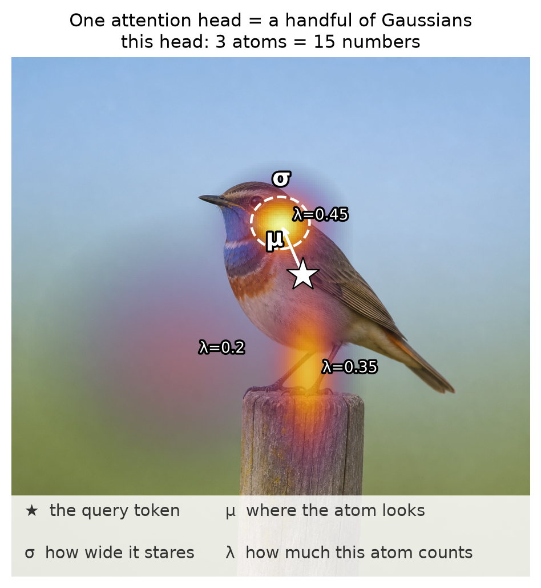
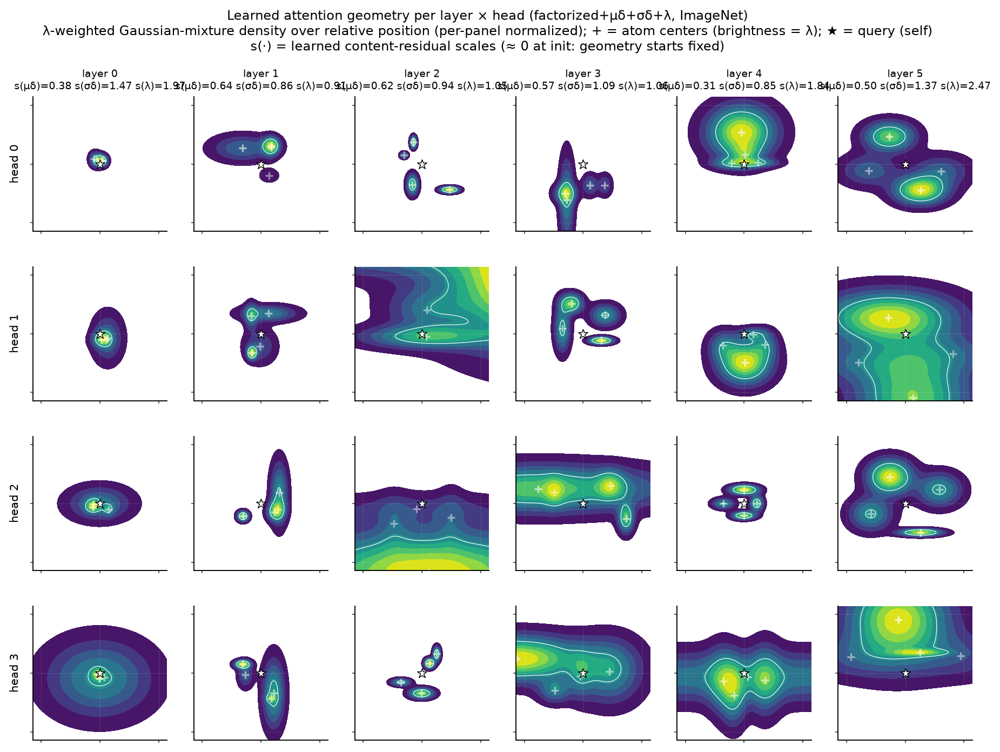

# SSOG: A Few Gaussians Is All You Need

> **License.** This project is free for non-commercial, academic, and
> open-source use under the AGPLv3. For commercial use, SaaS deployment, or to
> bypass the AGPL restrictions, you must purchase a commercial license.
> See [LICENSE](LICENSE) (`AGPL-3.0-or-later`) and
> [COMMERCIAL_LICENSE.md](COMMERCIAL_LICENSE.md).

**SSOG (Separable Sum of Gaussians)** swaps the transformer's content-scored
attention for a learned geometric field. Each attention head is a handful of
Gaussian atoms over *relative position*, plus tiny bounded nudges that let
content **steer** the field without ever scoring anything. No query-key dot
products, no N×N attention matrix. Just two 1D filter passes per atom.

Cheaper and more accurate than a matched ViT with scaled dot-product
attention: **fewer parameters, fewer FLOPs, higher ImageNet val acc**.

Turns out it works suspiciously well.



The full story and figures:
**[A Few Gaussians Is All You Need, on pisoni.ai](https://www.pisoni.ai/posts/ssog/)**

## Results

### Accuracy

From scratch, matched light recipe, one GPU:

| ImageNet-1k, 90 epochs | Val acc |
| :--- | :---: |
| Fixed field (zero content awareness) | 63.2 – 63.4% |
| Dot-product attention (baseline) | 64.34% |
| SSOG + steering (μδ) | 64.48% ± 0.13 |
| SSOG + full conditioning (μδ, σδ, λ) | **65.28% ± 0.02** |

On small data the geometric prior is a superpower: **70.4% vs 53.1%** for the
dot baseline on CIFAR-100 at matched recipe. And because the field is defined
over coordinates rather than token indices, you get zero-shot resolution
transfer for free: train at 224², score *higher* at 288² without a single
gradient step (d384 champion: **72.0% → 73.7%**).

### Efficiency

Scaled dot-product attention (SDPA) materializes an $N\times N$ score matrix.
For token width $d$:

$$\mathrm{SDPA}:\quad \mathcal{O}(N^{2}\,d)$$

SSOG never builds that matrix. A 2D Gaussian factorizes into two 1D filters,
so each of $R$ atoms (4 in the recipe) is applied along the rows then the
columns of a $\sqrt{N}\times\sqrt{N}$ grid:

$$\mathrm{SSOG}:\quad \mathcal{O}(R\,N\sqrt{N}\,d)$$

The gap widens with resolution: more tokens help SSOG relative to SDPA.

Same ViT recipe, ImageNet-1k, 90 epochs:

| Model | Params | FLOPs / forward | Val acc (90 ep) |
| :--- | ---: | ---: | ---: |
| d256 · SDPA | 3.66M | ~1.5 G | 64.34% |
| d256 · SSOG +μδσλ | 3.00M | ~1.0 G | **65.28%** |
| d384 · SDPA | 14.94M | ~6.3 G | 71.84% |
| d384 · SSOG +μδσλ | 11.96M | ~4.4 G | **72.02%** |

At d256 that is ~18% fewer parameters and ~33% fewer FLOPs, with a higher
score. At d384, ~20% fewer parameters and ~30% fewer FLOPs.

## How it works



Each head owns a few Gaussian atoms. An atom is five numbers: **μ** (where to
look, as an offset from the query), **σ** (how wide to stare) and **λ** (how
much this atom counts). The attention weight from token *p* to token *q* is
the value of the Gaussian mixture at their displacement. And since a 2D
Gaussian factorizes, applying it is two 1D passes per atom:

```python
# JAX
y = jnp.einsum("biwprj,bjwpd->biwpdr", ay, v)   # down the rows, per atom
y = jnp.einsum("biwprk,bikpdr->biwpdr", ax, y)  # across the columns
y = jnp.einsum("biwpr,biwpdr->biwpd", lam, y)   # mix atoms

# PyTorch — same contractions
y = torch.einsum("biwprj,bjwpd->biwpdr", ay, v)
y = torch.einsum("biwprk,bikpdr->biwpdr", ax, y)
y = torch.einsum("biwpr,biwpdr->biwpd", lam, y)
```

With `lookat=True` (the default), zero-initialized per-token probes predict
bounded residuals on μ, σ and λ behind cold-started gates: the model begins
life as a frozen geometric animal and opens the content taps itself, layer by
layer, exactly where steering pays off.

## What you get for free

**Interpretability.** "What did attention learn?" stops being a
heatmap-and-a-shrug question. Every head is a few blobs you can plot and read
with a ruler. Early layers become convolutions in disguise, middle layers turn
into strip detectors, late layers go global:



**Resolution transfer.** The field is defined over coordinates, not token
indices, so you can train at 224² and simply evaluate at a higher resolution.
Only the small position embedding needs a bilinear resize; the Gaussians
re-evaluate on the bigger grid like nothing happened. On the d384 champion,
288² scores **73.7%** — *higher* than the 72.0% at train resolution — without
one gradient step of fine-tuning.

**Speed that scales.** Complexity is $\mathcal{O}(R\,N\sqrt{N}\,d)$ instead of
$\mathcal{O}(N^{2}\,d)$ — see [Efficiency](#efficiency). The N×N matrix never
exists.

## Scope

This is the minimal, readable implementation of the mechanism and its matched
baseline — in JAX and in PyTorch. The part you need if you want to try it,
extend it, or break it.

---

## Install

The core package has **no** JAX or PyTorch dependency — pick a backend extra. `uv sync` with no
flags installs SSOG itself only.

### As a library

```bash
uv add ssog --extra jax          # JAX + Flax
uv add ssog --extra jax-cuda     # JAX with the CUDA 12 plugin
uv add ssog --extra torch        # PyTorch
```

pip: `pip install "ssog[torch]"`.

**CUDA PyTorch.** Linux PyPI `torch` wheels are usually CUDA already. For a
specific build, add torch from the PyTorch index *first*, then the extra:

```bash
uv add torch torchvision --index https://download.pytorch.org/whl/cu128
uv add ssog --extra torch
```

### This repo

`--extra` on `uv run` syncs that extra into `.venv` and then runs. Pass the
same `--extra` on later `uv run` so uv does not drop the backend.

| Extra | What you get |
| :--- | :--- |
| `jax` | `jax`, `flax` |
| `jax-cuda` | `jax[cuda12]`, `flax` |
| `torch` | `torch` |
| `examples-jax` | jax extra + `optax`, `datasets`, `Pillow` |
| `examples-jax-cuda` | jax-cuda extra + the same training deps |
| `examples-torch` | torch extra + `torchvision` |

```bash
uv sync --extra examples-torch
uv run --extra examples-torch python    # REPL / notebook
```

## Usage

Backends live in subpackages so importing one never pulls in the other.

```python
# JAX / Flax — images are NHWC
from ssog.jax import ViT, SSOGAttention

model = ViT(num_classes=100, attn="ssog")   # the Gaussian field
model = ViT(num_classes=100, attn="dot")    # its dot-product twin
```

```python
# PyTorch — images are NCHW; dropout follows model.train() / eval()
from ssog.torch import ViT, SSOGAttention

model = ViT(num_classes=100, attn="ssog")
logits = model(images)                      # (B, 3, 32, 32) → (B, 100)

attn = SSOGAttention(dim=256, num_heads=4, num_atoms=4, grid_h=16, grid_w=16)
tokens = attn(tokens)                       # (B, 16*16, 256) → (B, 16*16, 256)
```

The PyTorch modules are written for `torch.compile`: fully batched einsums,
static grid buffers, no Python loops over batch or heads.

```python
model = torch.compile(ViT(num_classes=100, attn="ssog").cuda())
```

### CIFAR-100

```bash
# JAX
uv run --extra examples-jax examples/train_cifar100.py --attn ssog --epochs 10
uv run --extra examples-jax examples/train_cifar100.py --attn dot  --epochs 10
uv run --extra examples-jax-cuda examples/train_cifar100.py --attn ssog --epochs 10

# PyTorch (torch.compile on CUDA by default; first epoch builds the graph)
uv run --extra examples-torch examples/train_cifar100_torch.py --attn ssog --epochs 10
uv run --extra examples-torch examples/train_cifar100_torch.py --attn dot  --epochs 10
uv run --extra examples-torch examples/train_cifar100_torch.py --attn ssog --no-compile
```

### `SSOGAttention`

Same knobs on `ssog.jax.SSOGAttention` and `ssog.torch.SSOGAttention`:

| Arg | Default | Role |
| :--- | :---: | :--- |
| `dim` | — | token width |
| `num_heads` | 6 | heads; each head owns `num_atoms` Gaussians |
| `num_atoms` | 4 | atoms per head |
| `grid_h`, `grid_w` | 8 | token grid the field is defined on |
| `lookat` | `True` | content-steered μ / σ / λ residuals |
| `max_offset` | 4 | bound on per-token μ travel, in grid cells |
| `cold_init` | `True` | gates start at ≈ 0 so geometry is frozen at init |
| `sigma_floor` | 0.25 | minimum atom width |

`lookat=False` is the purely geometric field. `cold_init=True` is the blog
recipe: zero-initialized probes behind a softplus gate that starts at
~3×10⁻⁴, so steering is off until the model opens it.

Tokens must be the row-major raster of `grid_h × grid_w`. The bundled ViT
patch embed does that; if you drop `SSOGAttention` into your own model,
reshape image tokens the same way.

PyTorch-only helper for plotting the *fixed* field (eager mode, not part of
the compiled `forward`):

```python
ay, ax = attn.axis_kernels()   # (H, R, Gh, Gh), (H, R, Gw, Gw)
```

## License

Copyright (c) 2026 Raphael Pisoni.

SSOG is licensed under the GNU Affero General Public License v3.0 or later
([LICENSE](LICENSE)). Commercial terms without AGPL copyleft are available
under a separate written agreement; see
[COMMERCIAL_LICENSE.md](COMMERCIAL_LICENSE.md).
